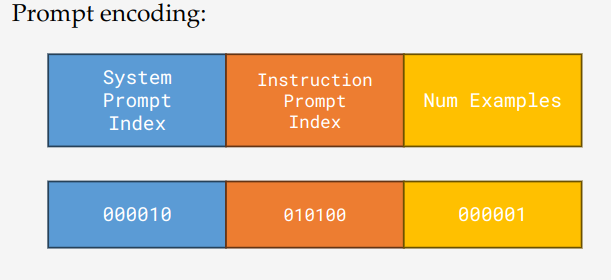
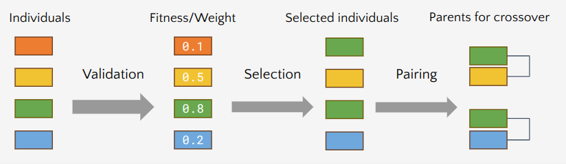
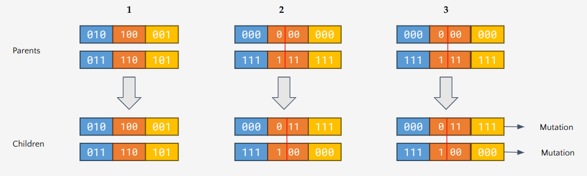
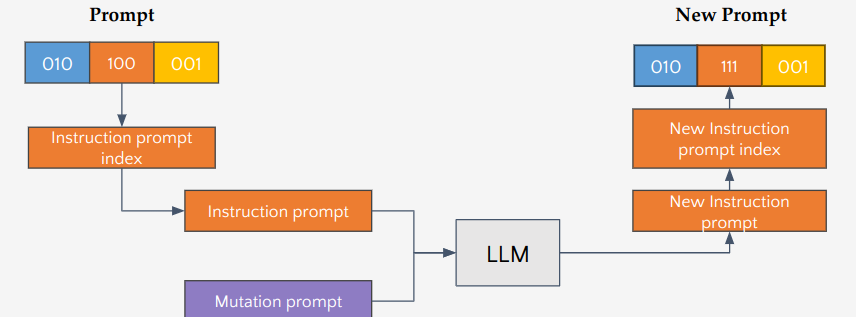

# Optimal Prompt Engineering using Genetic Algorithms

## Introduction

- **Prompt Engineering** is a new paradigm due to the advent of Large Language Models (LLMs).
- Involves developing and optimizing prompts for efficient usage of LLMs.
- Enhances LLMs' ability to handle complex tasks such as Question/Answering and Arithmetic reasoning.
- Premise: Prompting is critical for LLM performance.
- Current prompting techniques are manual.

### Goals of the Project

- Automate the generation of an "optimal" prompt using genetic algorithms.
- Gain insights into optimal prompt design patterns.
- Create a metric to measure prompt effectiveness.

## Dataset

- **GSM8K Dataset**: 8.5K high-quality, linguistically diverse grade school math word problems.
    - **Training set**: 7.47K problems.
    - **Test set**: 1.32K problems.
- Problems require 2-8 steps to solve, primarily using basic arithmetic operations (addition, subtraction, multiplication, and division).

**Example Problem:**
> Natalia sold clips to 48 of her friends in April, and then she sold half as many clips in May. How many clips did Natalia sell altogether in April and May?

**Solution:**
> Natalia sold 48/2 = 24 clips in May. Natalia sold 48 + 24 = 72 clips altogether in April and May.

## Baseline Performance to Beat

| Examples      | Mistral 7B | Llama 13B | Llama 70B | GPT-3.5 |
|---------------|------------|-----------|-----------|---------|
| Zero-shot     | 5%         | 4%        | 10%       | 23%     |
| One-shot      | 5%         | 13%       | 18%       | 36%     |
| Few-shot (3)  | 25%        | 21%       | 25%       | 54%     |

Performance is measured on the base prompt: **Solve the math word problem, giving your answer as an Arabic numeral.**

## Genetic Algorithm

- Useful for optimization problems with a **Fitness metric**.
- Works on the principle of **survival of the fittest**.
- Randomly create the initial population.
- Viable candidates are carried forward to the next generation using fitness scores.
- Techniques such as mutation and crossover generate members of the next population.
- Population evolves over several generations.

## Approach

### Algorithm Steps:

1. Encode scheme.
2. Generate initial population.
3. Validation and scoring.
4. Selection and pairing.
5. Crossover and mutation.
6. Generate the next generation.

### Initial Setup and Encoding Scheme

- **30** system prompts.
- **12** instruction prompts.
- **11** mutation prompts.
- **Generations**: 10 to 50.
- **Max number of examples allowed**: 4 to 9.
- LLM models: GPT-3.5, Llama 70B, Mistral 7B.
- **Num bits for encoding**: 6 to 9.

## Example System Prompts

- You are a math educator providing clear, practical guidance.
- Explain this math problem as a tutor to a novice.
- Tackle this using computational methods.
- As a computer scientist, apply algorithmic thinking to efficiently solve this problem.
- You are an assistant that employs critical thinking: analyze the problem, question assumptions, evaluate the evidence.
- Use creative thinking to generate innovative ideas and explore unconventional solutions.

## Example Instruction Prompts and Mutations

### Instructions Examples:

1. Solve the math word problem by converting words into algebraic notation and solve for unknown variables.
2. Break the problem into smaller, more manageable parts.
3. Give your answer as an Arabic numeral.
4. Make a list of ideas for solving this problem and apply them one by one.
5. Do NOT use words to write your answer.

### Mutation Examples:

- Reword the instruction for a younger audience using simpler language.
- Add an additional step to verify the solution through alternative methods.
- Focus on using a specific tool, like a graphing calculator.
- Reformat the instruction as a riddle to add mystery.
- Make the instruction more concise.

## Validation, Scoring, and Selection

- Each prompt is validated 10 times against 10 random problems from the dataset.
- Fitness score is the percentage of solved problems.
- A **roulette wheel mechanism** is used for selection, assigning weights based on fitness values.
- Pair consecutive individuals to create parents for crossover.

## Crossover and Mutation

- Selected individuals generate two children in one of three ways (with equal probability):
    1. **Elitism**: Children are identical to their parents.
    2. **Random splitting point**: Genes are combined at a random point.
    3. **Mutation**: Combine genes and mutate the instruction prompt.
    
## Mutation Process

1. Select a random mutation prompt.
2. Decode the instruction prompt to a string.
3. Generate a request to the LLM using both prompts.
4. The LLM returns a new instruction prompt, which is encoded and integrated into the prompt.

## Results

These are the results for the best prompt after running the genetic algorithm:

- Mistral 7B: 16% (deterioration)
- Llama 70B: 50% (improvement)
- GPT-3.5: 64% (improvement)

## Next Steps

- Improve the fitness function by considering factors like length, clarity, and gene survival.
- Vary genetic algorithm hyperparameters, such as population selection and mutations.
- Test with more datasets, including:
    - **MMLU**: Massive Multitask Language Understanding.
    - **MATH**: Problems across 5 difficulty levels and 7 subdisciplines.
    - **SQuAD**: Stanford Question Answering Dataset.
    - **DROP**: Reading comprehension and arithmetic.
